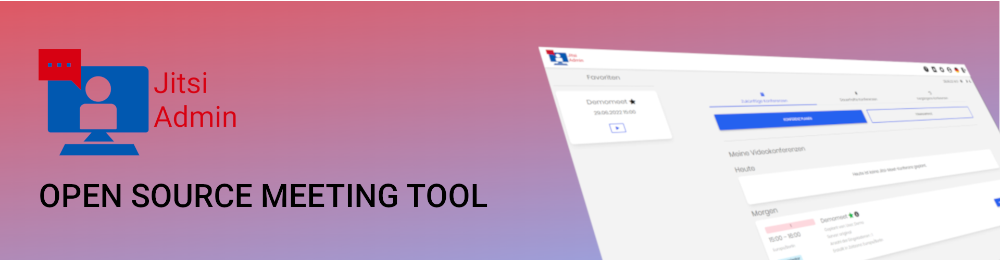
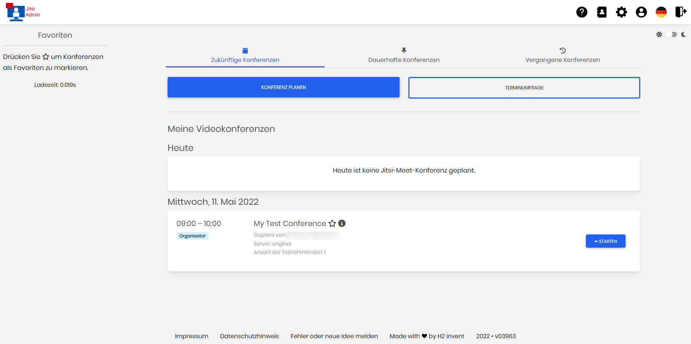
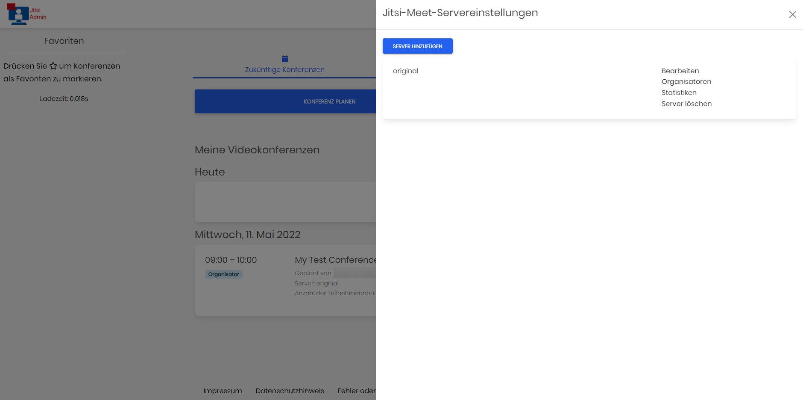
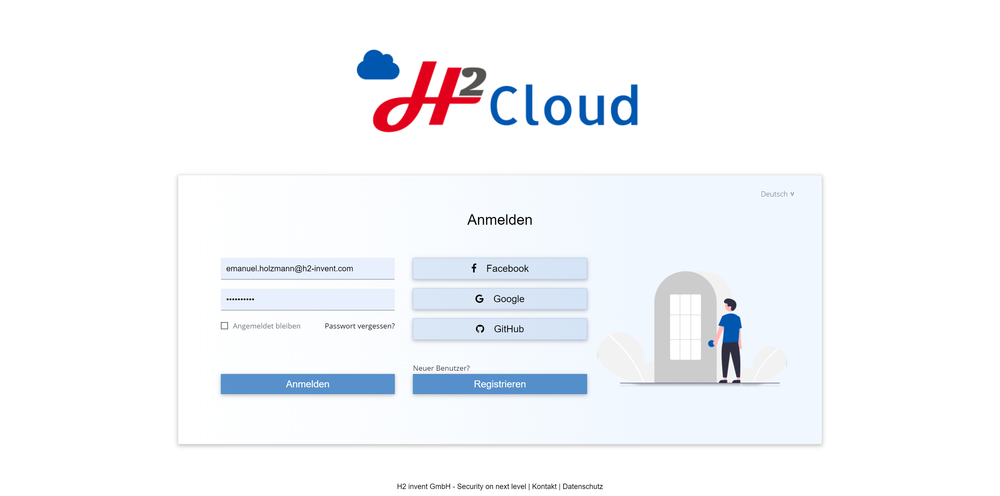
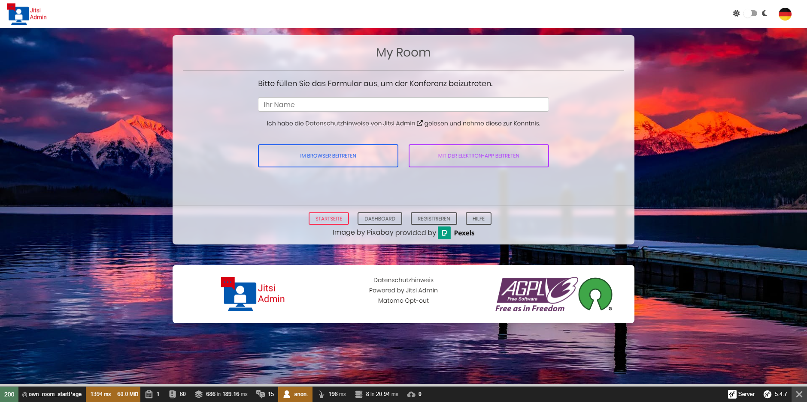
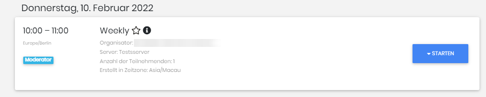

# Jitsi Admin

[](code_of_conduct.md)
[](https://crowdin.com/project/jitsi-admin)

Jitsi Admin is a tool to manage Jitsi conferences and server with JWT

### Known from


### Mailing list and contact

To directly chat with the community join our matrix group

__#jitsi-admin:h2-invent.com__


[Join the matrix group via matrix.to](https://matrix.to/#/#jitsi-admin:h2-invent.com)


Furthermore, we are excited to announce that we will be hosting an open conference every two weeks, where you can join us to discuss how we can make Jitsi and Jitsi-admin even more popular.
We welcome your ideas and suggestions to enhance the project and encourage you to be a part of this exciting initiative. The community talk takes place every even Thursday at 06:00pm

To join the community talk, please click on the subscription link provided: http://jitsi-admin.de/subscribe/self/4754e33d3ee9a6c40a2bf04ffa1528c7

Once you have subscribed, we will send you a reminder closer to the date of the talk. We hope to see you there!


If you want to be notified, if there are new updates or releases, you can subscribe to the __Jitsi Admin Update__ mailing list.
H2 invent will send out information to the mailing list concering releases, updates or new features.
This is __not__ a marketing newsletter.

If you want to join the mailing list just click on the link [Mailing List](https://verteiler.h2-invent.com/?p=subscribe&id=1) and enter your email address.
We use a double-opt-in process where you will receive a confirmation email containing a link with with you confirm, that you want to join to mailing list.

It is always possible to leave the mailing list.

More information can be found at https://jitsi-admin.de


# How to Install Jitsi-Admin
Jitsi-Admin is a tool that allows you to manage users and rooms on your Jitsi Meet instance. There are two ways to install Jitsi-Admin, depending on your needs.

## Docker Installation
If you want to start with a fresh installation, then select this installation method. Here are the prerequisites:

* unused port 80 (If you want to use letsencrypt which is shipped with the installation you need port 443 too)
* Docker and docker compose installed
* sed installed
* Debian 10 or comparable
* Docker engine version > 19.03.0 Docker Version check
* Tested with docker-compose version 2.4 and 2.7


```bash
wget https://github.com/jitsi-contrib/jitsi-admin/raw/main/installDocker.sh
sudo bash installDocker.sh
```
Follow the instructions that are shown to you.

## Normal Installation
This installation method is perfect if you have your own Keycloak SSO Server and want to get your Jitsi-Admin. Here are the prerequisites:

* Keycloak SSO Server (If you don't know what a Keycloak is, we recommend you install the Docker version using the Docker Installation method)
  * Realm, URL, Client ID, Client Secret
* Ubuntu 22 OS
To install Jitsi-Admin using the normal installation method, run the following command:

```bash
wget https://github.com/jitsi-contrib/jitsi-admin/raw/main/install.sh
sudo bash install.sh
```
Follow the instructions that are shown to you.

## Translation
Please help us to improve our localization

[](https://crowdin.com/project/jitsi-admin)
# Features

The following features are already part of Jitsi Admin:


### The Dashboard

The Dashboard is the central view where all information to all conferences is displayed


### The Servers

All servers can be managed centrally and different permissions can be configured.
Multiple Jitsi Servers can be combined to one setup and managed accordingly


### Login

The login uses a SSO Server, e.g. Keycloak or other Identidy Providers


### Join of the conference

Guests are able to join a conference through a link received via email __without__ having a user account in Jitsi Manager.
There is a page for joining where the conference ID, the email address and the name are entered.
After that a JWT will be generated and the guest is able to join the conference.


Users with a user account are able to join conferences directly via Jitsi Manager, either by using the web page or the Jitsi Electron Desktop App.



